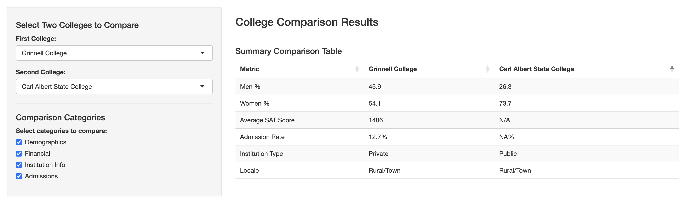

```{r setup, include=FALSE}
knitr::opts_chunk$set(echo = TRUE)
```

```{r echo = F, include = F}
library(dplyr)
library(ggplot2)
library(shiny)
library(tidyverse)
library(tidyr)
library(plotly)
library(DT)
library(cluster)
library(psych)
library(factoextra)
library(corrplot)
library(tibble)
library(tinytex)
```

# Introduction

This project explores higher education data from U.S. colleges to uncover trends related to **admissions selectivity, student body diversity, and institutional outcomes** such as graduation rates. The goal is to build an interactive Shiny app to help users — such as students and parents compare colleges based on customizable filters like state, admission rates, SAT scores, demographics, and more.

[Data Source - Most Recent Institution-Level Data](https://collegescorecard.ed.gov/data)

# Data Cleaning

```{r echo = F}
# Load data
data <- read.csv("https://raw.githubusercontent.com/khanhdo05/stats-final-230/main/Most-Recent-Cohorts-Institution.csv")
```

## Data Cleaning

We are using one source of csv for the r shiny app for all features so that we don't repeat columns in multiple tables. Do more NA filtering and specific-to-feature data cleaning in each feature in the [r shiny app script](./rShinyApp.R).

```{r}
print(nrow(data))
cleaned_data <- data %>%
  # Calculate ACT Median
  mutate(ACT_MEDIAN = ACTWRMID + ACTMTMID) %>%
  mutate(GRAD_DEBT_MDN = na_if(GRAD_DEBT_MDN, "PrivacySuppressed")) %>%
  mutate(GRAD_DEBT_MDN = as.numeric(GRAD_DEBT_MDN)) %>%
  
  # Select only relevant columns
  dplyr::select(
    INSTNM, INSTURL, CONTROL, SAT_AVG, ADM_RATE, LOCALE, ACT_MEDIAN, GRAD_DEBT_MDN, UGDS,
    UGDS_WHITE, UGDS_BLACK, UGDS_HISP, UGDS_ASIAN, UGDS_AIAN, UGDS_NHPI, UGDS_2MOR, UGDS_NRA, UGDS_UNKN
    ) %>%
  
  # Drop rows that have NA values for all SAT_AVG, ADM_RATE, and LOCALE
  filter(!(is.na(SAT_AVG) & is.na(ADM_RATE) & is.na(LOCALE))) %>%
  
  # Drop rows that have NA values for all UGDS_'RACE'
  filter(!(is.na(UGDS_WHITE) & is.na(UGDS_BLACK) & is.na(UGDS_HISP) & is.na(UGDS_ASIAN) & is.na(UGDS_AIAN) &
             is.na(UGDS_NHPI) & is.na(UGDS_2MOR) & is.na(UGDS_NRA) & is.na(UGDS_UNKN))) %>%
  
  # Binary variable for colleges that are public and is in city or suburb
  mutate(
    IS_PUBLIC = case_when(
      CONTROL == 1 ~ 1,
      CONTROL %in% c(2, 3) ~ 0,
      TRUE ~ NA_real_
    ),
    IS_CITY = case_when(
      LOCALE >= 11 & LOCALE <= 23 ~ 1,
      LOCALE >= 31 & LOCALE <= 43 ~ 0,
      TRUE ~ NA_real_
    )) %>%
  
  # Remove column that is no longer needed
  select(!c("CONTROL", "LOCALE"))

print(nrow(cleaned_data))

# Writing to csv file
write_csv(cleaned_data, "cleaned_data.csv")
```

## Gender & Racial Composition

Users will be able to select an institution and view its gender and racial composition through two separate Plotly pie charts. The gender chart will show the breakdown of `UGDS_MEN` and `UGDS_WOMEN`, while the racial chart will display variables like `UGDS_WHITE`, `UGDS_BLACK`, `UGDS_HISP`, `UGDS_ASIAN`, and more. Both charts will display raw percentages when hovering over each slice, giving a quick and clear breakdown of the student body demographics.

```{r}
# Data cleaning
feature1data <- data %>%
  dplyr::select(INSTNM, UGDS_MEN, UGDS_WOMEN, UGDS_WHITE, UGDS_BLACK, UGDS_HISP, UGDS_ASIAN, UGDS_AIAN, UGDS_NHPI, UGDS_2MOR, UGDS_NRA, UGDS_UNKN) %>%
  filter(!(is.na(UGDS_MEN) & is.na(UGDS_WOMEN) & is.na(UGDS_WHITE) & is.na(UGDS_BLACK) & is.na(UGDS_HISP) & is.na(UGDS_ASIAN) & is.na(UGDS_AIAN) & is.na(UGDS_NHPI) & is.na(UGDS_2MOR) & is.na(UGDS_NRA) & is.na(UGDS_UNKN))) 

# Write to csv file
write_csv(feature1data, "cleaned_feature1data.csv")

# Sketch Visualization
selected_inst <- "Grinnell College"

selected_data <- feature1data %>%
  filter(INSTNM == selected_inst)

# Gender chart
gender_labels <- c("Men", "Women")
gender_columns <- c("UGDS_MEN", "UGDS_WOMEN")
gender_values <- as.numeric(selected_data[1, gender_columns])

gender_chart <- plot_ly(
  labels = gender_labels,
  values = gender_values,
  type = "pie",
  name = "Gender"
) %>%
  layout(title = paste("Gender Composition of", selected_inst))

# Racial chart
race_labels <- c("White", "Black", "Hispanic", "Asian", 
                 "American Indian/Alaska Native", "Native Hawaiian/Pacific Islander",
                 "Two or More", "Non-Resident Alien", "Unknown")

race_columns <- c("UGDS_WHITE", "UGDS_BLACK", "UGDS_HISP", "UGDS_ASIAN",
                  "UGDS_AIAN", "UGDS_NHPI", "UGDS_2MOR", "UGDS_NRA", "UGDS_UNKN")

race_values <- as.numeric(selected_data[1, race_columns])

race_chart <- plot_ly(
  labels = race_labels,
  values = race_values,
  type = "pie",
  name = "Race"
) %>%
  layout(title = paste("Racial Composition of", selected_inst))

# Display both charts
gender_chart
race_chart
```


## Filter Colleges

The app will feature sliders for SAT average and admission rate (in ranges), along with filters for state and institution `CONTROL` type (Public = 1, Private = 2 or 3), Locale (by rural & town, suburb & city) . Based on the user's selections, the app will return a list of colleges that meet the criteria in the form of a scatter plot with x-axis is the SAT average and y-axis is the Admission rate, where on hover the point, it shows the information, on click, user can click on the school website link. User will also have the option to tick whether they want to include criteria SAT, Admission rate. For Locale and IS_PUBLIC, they can also not tick any box or all boxes. The sliders for SAT and Admission rate would have a start and end pointer to show the range in which they want to filter for.

```{r}
# Data cleaning
feature2data <- data %>%
  # Select only relevant variables
  dplyr::select(INSTNM, INSTURL, CONTROL, SAT_AVG, ADM_RATE, LOCALE) %>%
  # Drop rows that have NA values for all SAT_AVG, ADM_RATE, and LOCALE
  filter(!(is.na(SAT_AVG) & is.na(ADM_RATE) & is.na(LOCALE))) %>%
  # Binary variable for colleges that are public and is in city or suburb
  mutate(
    IS_PUBLIC = case_when(
      CONTROL == 1 ~ 1,
      CONTROL %in% c(2, 3) ~ 0,
      TRUE ~ NA_real_
    ),
    IS_CITY = case_when(
      LOCALE >= 11 & LOCALE <= 23 ~ 1,
      LOCALE >= 31 & LOCALE <= 43 ~ 0,
      TRUE ~ NA_real_
    )) %>%
  # Remove column that is no longer needed
  select(!c("CONTROL", "LOCALE"))

# Writing to csv file
write_csv(feature2data, "cleaned_feature2data.csv")

df <- feature2data %>%
  mutate(
    SAT_AVG = as.numeric(SAT_AVG),
    ADM_RATE = as.numeric(ADM_RATE)
  ) %>%
  filter(!is.na(SAT_AVG), !is.na(ADM_RATE))

# Sketch visualization
plot_ly(
  data = df,
  x = ~SAT_AVG,
  y = ~ADM_RATE,
  type = 'scatter',
  mode = 'markers',
  text = ~paste(
    "School:", INSTNM,
    "<br>SAT:", SAT_AVG,
    "<br>Adm Rate:", round(ADM_RATE, 3)
  ),
  hoverinfo = 'text',
  marker = list(color = 'rgba(0, 102, 204, 0.6)', size = 10)
) %>%
layout(
  title = "Colleges: SAT vs Admission Rate",
  xaxis = list(title = "Average SAT Score"),
  yaxis = list(title = "Admission Rate"),
  annotations = list(
    x = 0.5, y = 1,  # Positioning the subtitle
    text = "Hover over and click on a point to see details about the school.",
    showarrow = FALSE,
    font = list(size = 14),
    align = 'center',
    xref = 'paper', yref = 'paper'
  )
)
```


## Find Similar Colleges

The app will include a plot that allows users to filter colleges based on median student debt, median earnings, undergraduate enrollment, admission rate, and ACT average (calculated from subject scores using data manipulation). After selecting a college of interest, the app will use clustering techniques to identify and visualize similar institutions, helping users explore comparable schools based on these key financial and academic attributes.

```{r}
# Data cleaning
feature3data <- data %>%
  mutate(ACT_MEDIAN = ACTWRMID + ACTMTMID) %>%
  select(INSTNM, UGDS, ADM_RATE, ACT_MEDIAN, GRAD_DEBT_MDN) %>%
  mutate(GRAD_DEBT_MDN = na_if(GRAD_DEBT_MDN, "PrivacySuppressed")) %>%
  mutate(GRAD_DEBT_MDN = as.numeric(GRAD_DEBT_MDN)) %>%
  drop_na()

# Write to csv file
write_csv(feature3data, "cleaned_feature3data.csv")

# Scale features (exclude school name)
features_scaled <- feature3data %>%
  select(-INSTNM) %>%
  scale()

# K-means clustering
k2 <- kmeans(features_scaled, centers = 2, nstart = 25)

# Extract numeric features and scale
school_names <- feature3data$INSTNM
features_only <- feature3data %>% select(-INSTNM)
scaled_features <- scale(features_only)

# Sketch visualization no.1
# Obviously, there is still modifications to come to make this easier to read
fviz_cluster(k2, data = scaled_features, 
             labelsize = 7,
             main = "K-means Clustering of Colleges",
             repel = TRUE) +
  geom_text(aes(label = school_names), size = 2, vjust = 1.5, hjust = 1.2)

# PCA for 2D visualization
pca <- prcomp(features_scaled)
pca_data <- as.data.frame(pca$x[, 1:2]) # PC1 and PC2
pca_data$School <- feature3data$INSTNM
pca_data$Cluster <- as.factor(k2$cluster)

# Sketch visualization no.2
plot_ly(pca_data, 
        x = ~PC1, 
        y = ~PC2, 
        type = 'scatter', 
        mode = 'markers',
        color = ~Cluster,
        text = ~paste("School:", School,
                      "<br>Cluster:", Cluster),
        hoverinfo = 'text') %>%
  layout(
    title = "Interactive K-means Cluster Plot (PCA)",
    xaxis = list(title = "Principal Component 1"),
    yaxis = list(title = "Principal Component 2"),
    annotations = list(
      x = 0.5, y = 1,  # Positioning the subtitle
      text = "Hover over on a point to see which school it is.",
      showarrow = FALSE,
      font = list(size = 14),
      align = 'center',
      xref = 'paper', yref = 'paper'
  ))
```


# College Comparison

This feature allows users to select two institutions and compare them across key characteristics. Simply select any two institutions from the drop-down menu to see a side-by-side analysis of key characteristics, including gender demographics, average SAT scores, admissions rate, school type, and location. Users can customize the view to show or hide specific comparison categories to focus on factors that truly matter to them.

```{r}
# Load cleaned data
feature1data <- readr::read_csv("cleaned_feature1data.csv") # Demographics
feature2data <- readr::read_csv("cleaned_feature2data.csv") # Admissions, Institution Info

college1 <- "Grinnell College"
college2 <- "Carleton College"

# Demographics
college1_demo <- feature1data %>% filter(INSTNM == college1)
college2_demo <- feature1data %>% filter(INSTNM == college2)

# Admissions, Institution Info
college1_adm <- feature2data %>% filter(INSTNM == college1)
college2_adm <- feature2data %>% filter(INSTNM == college2)

# School details comparison
info_data <- data.frame(
  Category = c("Location", "Institution Type"),
  !!college1 := c(
    ifelse(!is.na(college1_adm$IS_CITY[1]), ifelse(college1_adm$IS_CITY[1] == 1, "City/Suburb", "Rural/Town"), "N/A"),
    ifelse(!is.na(college1_adm$IS_PUBLIC[1]), ifelse(college1_adm$IS_PUBLIC[1] == 1, "Public", "Private"), "N/A")
  ),
  !!college2 := c(
    ifelse(!is.na(college2_adm$IS_CITY[1]), ifelse(college2_adm$IS_CITY[1] == 1, "City/Suburb", "Rural/Town"), "N/A"),
    ifelse(!is.na(college2_adm$IS_PUBLIC[1]), ifelse(college2_adm$IS_PUBLIC[1] == 1, "Public", "Private"), "N/A")
  )
)
print(info_data)

# Summary table with all categories
summary_table <- data.frame(
  Metric = c(
    "Men %", "Women %",
    "Location", "Institution Type", "SAT Avg", "Admission Rate"
  ),
  !!college1 := c(
    round(college1_demo$UGDS_MEN[1] * 100, 1),
    round(college1_demo$UGDS_WOMEN[1] * 100, 1),
    ifelse(!is.na(college1_adm$IS_CITY[1]), ifelse(college1_adm$IS_CITY[1] == 1, "City/Suburb", "Rural/Town"), "N/A"),
    ifelse(!is.na(college1_adm$IS_PUBLIC[1]), ifelse(college1_adm$IS_PUBLIC[1] == 1, "Public", "Private"), "N/A"),
    college1_adm$SAT_AVG[1],
    paste0(round(college1_adm$ADM_RATE[1] * 100, 1), "%")
  ),
  !!college2 := c(
    round(college2_demo$UGDS_MEN[1] * 100, 1),
    round(college2_demo$UGDS_WOMEN[1] * 100, 1),
    ifelse(!is.na(college2_adm$IS_CITY[1]), ifelse(college2_adm$IS_CITY[1] == 1, "City/Suburb", "Rural/Town"), "N/A"),
    ifelse(!is.na(college2_adm$IS_PUBLIC[1]), ifelse(college2_adm$IS_PUBLIC[1] == 1, "Public", "Private"), "N/A"),
    college2_adm$SAT_AVG[1],
    paste0(round(college2_adm$ADM_RATE[1] * 100, 1), "%")
  )
)
print(summary_table)
```

